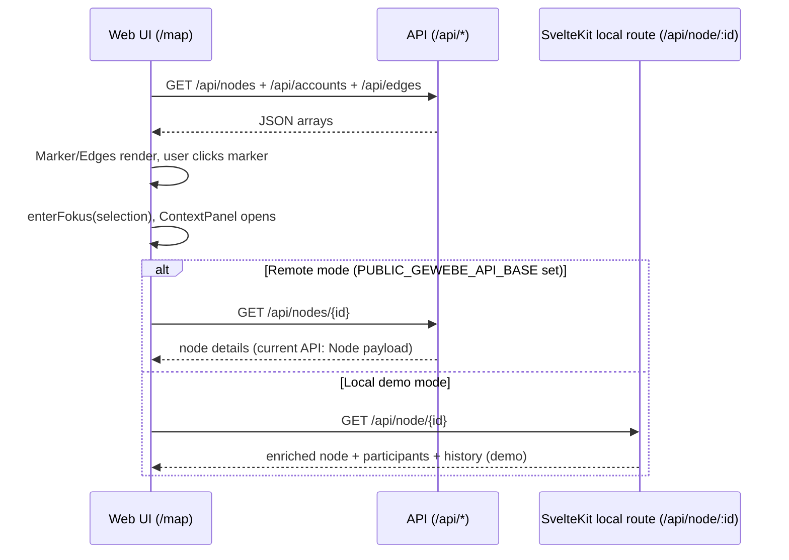
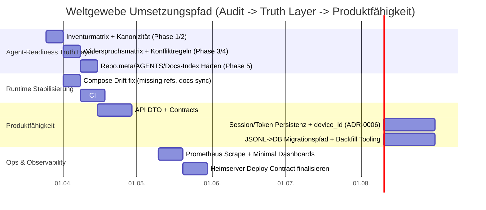
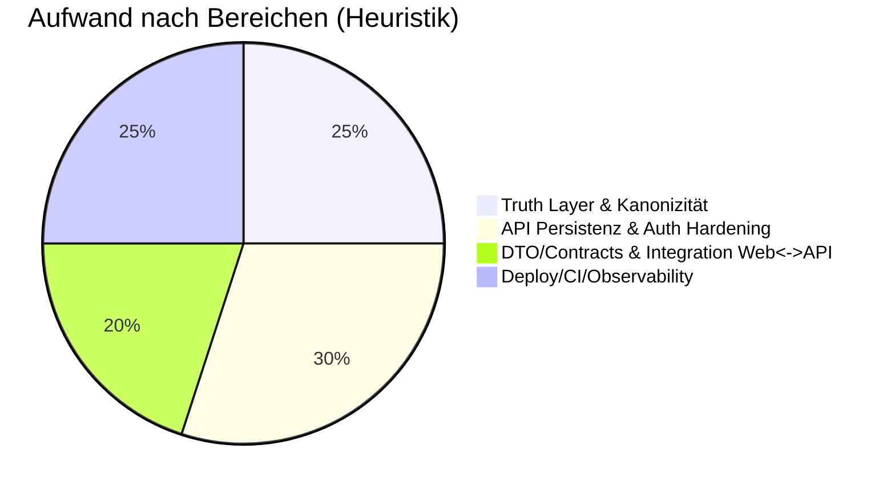

# Weltgewebe Repository-Audit und Ausarbeitung des Agent-Readiness-Masterplans

## Executive Summary

**These:** Das Repository ist bereits ungewöhnlich nah an „agentenlesbarer Wahrheit“: Es gibt deklarierte kanonische Quellen, Schreibgrenzen, Policies, Contracts und eine disziplinierte UI- und Privacy-Normativität.
**Antithese:** Genau diese Menge an Quellen erzeugt aktuell die klassischste Agent-Falle: „formal geordnet, aber nicht eindeutig entscheidbar“ – insbesondere dort, wo Doku-Status („Docs-only“) und Implementierung (API/Web/Compose) gleichzeitig real sind.
**Synthese:** Aus dem Masterplan wird (im Sinne deiner Datei) ein **Audit mit Entscheidungslogik**, nicht „noch mehr Doku“: Wir verdichten die Wahrheitsschicht (Lesereihenfolge, Konfliktauflösung, Abbruchregeln) und binden sie an die realen Module (API/Web/Infra/CI), sodass Agenten **reproduzierbar** und **ohne Interpolationsdrift** arbeiten.

**Alternative Sinnachse (Zielannahme kippen):**
Statt „Weltgewebe als Produkt bauen“ kann man Weltgewebe als **Wahrheitssystem** verstehen, das später Produktarbeit **ermöglicht**. Dann ist „Agent-Readiness“ nicht Feature, sondern *Betriebssystem der Wissensordnung*. Das verschiebt Prioritäten: erst Konfliktlogik & Lesepfade, dann Features.

**Resonanz- und Kontrastprüfung (zwei plausible Deutungen):**
Deutung A („fast agent-ready“) passt zu AGENTS/Policy/State-Machine-Strenge.
Deutung B („formal agent-ready, aber nicht operationalisiert“) passt, weil **Konfliktauflösung**, **Abbruch-/Escalation-Regeln** und die Trennschärfe „Navigation vs Wahrheit“ noch nicht hart sind.
**Gewichtung:** B ist derzeit tragfähiger, weil Agenten bei widersprüchlichen Quellen sonst „höflich halluzinieren“.

**Unsicherheitsgrad (0–1): 0,28.** Ursachen: offene Zielumgebung (prod vs heimserver vs demo), nicht spezifizierte Last-/Threat-Model-Annahmen, aktive offene PRs.
**Interpolationsgrad (0–1): 0,33.** Hauptquellen der Annahmen: Ableitung von „Soll“ aus Blueprints/ADRs vs „Ist“ aus Code/Compose; einzelne Bereiche (z. B. Basemap-Build) nur durch PR-Signal bekannt.

**Essenz in drei Sätzen:**
Hebel: **Konfliktlogik + Lesepfad** als harte Wahrheitsschicht.
Entscheidung: „Docs-only“ nicht als Statuslabel, sondern als **Gate-Disziplin** operationalisieren (was gilt wann).
Nächste Aktion: Inventurmatrix + Widerspruchsmatrix direkt aus dem Repo ziehen und als Prioritäts-Backlog übersetzen.

## Methodik, Quellenrangfolge und Evidenzlage

**Informationsbedarf (3–6 Kernfragen):**
Erstens: Welche Artefakte sind *kanonisch* und wie wird Widerspruch entschieden?
Zweitens: Was sind reale Runtime-Pfade (Dev/Prod/Heimserver) inkl. Schnittstellen Web↔API↔Daten?
Drittens: Wie sehen Datenmodelle in **Contracts**, **Docs (Datenmodell)** und **Implementierung** aus – und wo divergieren sie?
Viertens: Welche Roadmap-Signale existieren (Blueprints/Process + PRs) und welche Tasks lassen sich in Milestones gießen?
Fünftens: Welche Maßnahmen erhöhen Sicherheit/Performance/Testbarkeit mit vertretbarem Aufwand?

**Quellengewichtung (nach Systemtiefe/Primärnähe/Replizierbarkeit):**
Primär und bindend: `repo.meta.yaml`, `AGENTS.md`, `agent-policy.yaml`, Contracts (`contracts/domain/*.schema.json`), Compose/Caddy/CI als ausführbare Realität.
Sekundär/interpretierend: Blueprints/ADRs/Process-Dokus, weil sie Sollbilder sind und Drift riskieren.
Tertiär: `_generated` ist Diagnose/Spiegel, nicht Ursprung (explizit auch im Masterplan).

**Epistemische Leere (X fehlt, nötig für Y):**
Ein explizites, maschinenfestes **Konfliktauflösungsprotokoll** fehlt (X), nötig für deterministische Agentenentscheidungen (Y).
Ein explizites **Abbruch-/Escalation-Protokoll** fehlt (X), nötig damit Agenten nicht „kreativ glätten“ (Y).
Zielumgebung (VPS vs Heimserver vs rein lokal) fehlt (X), nötig für belastbare Security-/Ops-Empfehlungen (Y).

## Repository-Inventur und Struktur

### Überblick über Hauptmodule und Schlüsselpfade

Der Repo-„Truth Core“ ist formal definiert (Entry Points + kanonische Quellen + generated Artefakte).
Gleichzeitig existieren produktionsnahe Implementierungen (API/Web/Compose/CI), trotz „Docs-only“-Label im README.

**Struktur (Ist-Sicht, zusammengeführt aus Root/Docs/Apps/Infra):**

| Bereich | Zweck | Schlüsselpfade (Beispiele) | Abhängigkeiten/Runtime |
|---|---|---|---|
| Truth/Policies/Meta | Kanonizität, Schreibgrenzen, operative Leitplanken | `repo.meta.yaml`, `AGENTS.md`, `agent-policy.yaml`, `policies/*` | Repo-interne Normativität |
| Web (SvelteKit) | Mobile-first Karte + UI-Modi + E2E | `apps/web/src/routes/map/*`, `apps/web/src/lib/*`, `apps/web/package.json` | Node >=20.19, pnpm, SvelteKit, MapLibre |
| API (Rust/Axum) | REST API, Auth (Magic Link), Health/Metrics | `apps/api/src/*`, `apps/api/tests/*`, `apps/api/Dockerfile` | Rust, Axum, optional Postgres/NATS/SMTP |
| Contracts | JSON Schemas als Datenvertrag | `contracts/domain/*.schema.json` | ajv/CI-Validate |
| Infra/Deploy | Dev/Prod/Heimserver Deploypfade | `infra/compose/*`, `infra/caddy/*` | Docker Compose, Caddy, Postgres, NATS |
| CI/Guards | Reproduzierbare Checks + E2E | `.github/workflows/*.yml`, `ci/*`, `scripts/tests/*` | GitHub Actions, pnpm, Rust toolchain |

Belege: Repo-Entry/Canon, Policies, Apps, Contracts, Compose, Workflows.

### Datenmodelle: Soll (Contracts/Docs) vs Ist (API/Web)

**Belegt (Datenvertrag):** Domain-Entities sind `node`, `edge`, `conversation`, `message` (und `account`, `role`), „thread“ ist verboten.
**Ist (API/Web heute):** Web und API arbeiten primär mit `nodes`, `edges`, `accounts`; Conversations/Messages sind in UI als Tabs teilweise Scaffold, aber nicht implementiert.

**Privacy-Identitätsmodell (RoN/verortet):** In Contract und Backend ist „mode“ fundamental; RoN hat keine individuelle Location/public_pos.

## Komponentenanalyse

### Web-App: Zweck, Schnittstellen, Beispiele

**Zweck:** Karte + Marker/Edges + Kontextpanel mit drei globalen Systemzuständen (`navigation`, `fokus`, `komposition`) und lokalen Overlays (Suche/Filter).
**Inputs:** REST-Listen `GET /api/nodes`, `GET /api/accounts`, `GET /api/edges`; optional Detailpfade für Panels.
**Outputs:** UI-Interaktionen (Marker click -> selection), MapLibre-Layer (Marker + GeoJSON edges), API-Calls (Auth, Detailfetch).

**Public Interface (Web):** `/map` als Hauptroute.
**Beispiel (Dev-Start):**

```bash
cd apps/web
corepack enable
pnpm install
pnpm dev -- --host 0.0.0.0 --port 5173
```


**Typische Fehlannahme, aktiv korrigiert:**
„Wenn `PUBLIC_GEWEBE_API_BASE` leer ist, ist das Web offline.“ – Nein: Dann wird relativ gegen `/api/*` gefetcht; ob das funktioniert hängt davon ab, ob ein Proxy (Caddy Dev) oder ein Demo-Server den Pfad liefert.

### API-Service: Zweck, Endpunkte, Konfiguration

**Zweck:** Axum-Service mit Health/Metrics, Auth (Dev-Login + Magic Link), sowie Node/Edge/Account-API.
**Datenspeicher (Ist):** Demo/Local first über JSONL in `GEWEBE_IN_DIR` (default `.gewebe/in`), z. B. `demo.nodes.jsonl`, `demo.edges.jsonl`.
**Datenspeicher (Soll/Infra-Option):** Compose sieht Postgres + (optional/angedeutet) NATS JetStream vor, Readiness prüft DB/NATS optional.

**Konfiguration:** Embedded Defaults `configs/app.defaults.yml` + Env Overrides (`HA_*`, `AUTH_*`, `SMTP_*`, `POLICY_LIMITS_PATH`).

**Auth-Mechanik (Ist):**
Sessions und Tokens sind in-memory Stores; Cookie ist standardmäßig `SameSite=Lax` (für Email-Navigation), Secure ist env-gesteuert.
CSRF-Schutz erfolgt über Origin/Referer/Host-Validierung + Allowlist.
**Mismatch sichtbar halten:** ADR-0005 nennt „SameSite=Strict“ als Minimierungsstrategie, die Implementierung nutzt Lax (plausibel wegen Magic-Link Flows, aber das sollte explizit als Entscheidung dokumentiert sein).

**Beispiel (API-Health & Version):**

```bash
curl -fsS http://localhost:8080/health/live
curl -fsS http://localhost:8080/health/ready
curl -fsS http://localhost:8080/version
```


### Contracts und Policies: Zweck, Verifikation, Nutzung

**Contracts (Domain-Schemas):** JSON-Schemas für `account/node/edge/conversation/message/role` mit CI-Validierung via ajv.
**Policies:** Limits, Perf-Budgets, SLO, Security, Retention. Sie sind bereits in Dateien formalisiert und teils in API-Readiness/Deploy referenziert.

**Beispiel (Contract-Check lokal, Repo-Skript):**

```bash
# Root-level
pnpm install
pnpm run contracts:domain:check
```


### Infra: Compose und Caddy als Runtime-Wahrheit

**Dev-Stack (Gate C / compose.core):**

- `web` (Vite dev)
- `api` (cargo run)
- `db` (Postgres 16 + init scripts)
- `pgbouncer`
- `caddy` als Frontdoor auf `:8081` (proxy /api + web)

**Prod/Heim-first (compose.prod + overrides):**

- `api` als Image + bind-mount policies
- `db`, `nats`, `caddy` (inkl. basemap/map-style/web mounts, Security Headers, /api reverse_proxy)

**Typische Fehlannahme, aktiv korrigiert:**
„In Repo-Dokus steht PostGIS, also ist PostGIS aktiv.“ – In `infra/compose/sql/init/00_extensions.sql` werden aktuell `uuid-ossp` und `pgcrypto` angelegt; PostGIS ist (in den gezeigten Init-Skripten) nicht dabei.

## Architektur, Laufzeitfluss und Deployment

### Architekturdiagramm

```mermaid
flowchart LR
 U[Browser / Mobile] -->|HTTPS| C[Caddy Frontdoor]
 C -->|static| W[Web: SvelteKit build
oder Vite dev]
 C -->|/api/*| A[API: Rust/Axum]
 A -->|read/write| J[JSONL: .gewebe/in
(demo.*.jsonl)]
 A -->|optional| P[(Postgres)]
 A -->|optional| N[(NATS JetStream)]
 A -->|optional| S[SMTP]
 A --> M[/metrics
Prometheus/]
 A --> H[/health/live
/health/ready/]
 subgraph Deploy-Modi
 D1[Dev: compose.core + Caddyfile.dev]
 D2[Prod: compose.prod + Caddyfile.heim]
 D3[Heimserver override]
 end
```


### Laufzeitfluss: Map-Interaktion und Detailpanel

**Ist-Fluss (vereinfacht, aber direkt aus Code ableitbar):**
Page Load holt Listen (`nodes/accounts/edges`), Map zeichnet Marker/Edges, Klick setzt `selection` und öffnet Panel, NodePanel lädt Details über einen Modus-abhängigen Endpoint (remote: `/api/nodes/:id`, lokal: `/api/node/:id`).




**Wichtige sichtbare Drift (nicht glattbügeln):**
Die lokale SvelteKit-Demo liefert bereits „enriched“ Node-Details (participants/history), die Rust-API (Stand der gesichteten Node-Routes) primär Node/Edge/Account-Objekte aus JSONL liefert – das ist funktional ok für Gate A/B, aber erzeugt später ein Integrationsloch, wenn Web „enriched“ als Contract erwartet.

### Deployment-Optionen

- **Dev (lokal/Codespaces):** `docker compose -f infra/compose/compose.core.yml --profile dev up -d --build` + Frontdoor auf `:8081`.
- **Prod/Heim-first:** `infra/compose/compose.prod.yml` + Overrides (prod/heimserver), Caddy serviert statische Web-Builds und proxyt `/api/*`.
- **Observability (optional):** `compose.observ.yml` bringt Prometheus/Grafana/Loki/Tempo hoch – aktuell ohne ausgearbeitete Config-Mounts.

**CI/CD (Pipeline-Realität):**

- `ci.yml` trennt docs-only Änderungen von „heavy CI“, führt `just ci` aus und startet Web-E2E mit Demo-API.
- `web.yml` ist path-scoped, enthält Vitest + Playwright, baut und lintet SvelteKit.
- `contracts-domain.yml` compiliert Schemas und validiert Beispiele.

## Roadmap, Agent-Readiness und Signale aus PRs

### Dokumentierte Roadmap-Signale

- UI-Roadmap ist sehr konkret (Phasen, PR-Schritte, Done-Marker) und referenziert die State-Machine als kanonische Norm.
- Prozess-Fahrplan (Gate A–D) existiert als Checklisten-Logik und wird im README als Re-Entry-Mechanismus zitiert.
- ADR-0043 räumt Terminologie (edge vs conversation) auf und ist entscheidend, um spätere API/UI-Drift zu verhindern.

### Offene Issues / PRs als Roadmap-Sensor

- **Open Issues:** keine offenen Issues gefunden (per GitHub-Suche).
- **Open PRs (3 relevante Signale):**
- PR #950: Auth-EP `POST /auth/logout-all` (Roadmap-Schritt) – spricht für systematische Abarbeitung des Auth-Blueprints.
- PR #951: Deploy/Edge-Hardening, Verifikation/Logs – spricht für Ops-Realität und „keine False-Greens“.
- PR #952: Basemap-Sentinel-Contract alignment – spricht für Contract-first Drift-Fixes.

>(Die PRs sind aktives, zeitnahes Signal; sie erklären auch, warum „Docs-only“ als Label nicht die ganze Realität beschreibt.)

### Masterplan-Anwendung auf dieses Repo: Audit-Matrix (Phase 1/2), Widerspruchsmatrix (Phase 3)

Dein Masterplan verlangt pro Datei: Rolle, Normativität, Zielgruppe, Konfliktpotenzial, Veraltungsrisiko, Änderungsbedarf.
Unten ist eine **komprimierte** Inventur- und Kanonizitätsmatrix (repräsentative Auswahl der wichtigsten Truth-Träger).

| Artefakt | Rolle | Normativität | Konfliktpotenzial | Beobachtung (Ist) | Maßnahme (Plan) |
|---|---|---|---|---|---|
| `repo.meta.yaml` | Truth-Gerüst | hoch | mittel | Entry Points + canonical + generated, aber ohne Konfliktregel | Konfliktauflösung + Rangfolge ergänzen (Phase 4/5) |
| `AGENTS.md` | Leseanweisung | hoch | mittel | gute Primärnähe, aber noch generisch | verschlanken + „Leseprotokoll“ präzisieren |
| `agent-policy.yaml` | Schreibgrenzen | hoch | niedrig | forbids + target-proof gut | um Lesewahrheit/Abbruchregeln ergänzen |
| `docs/index.md` | Navigation | mittel | hoch | breite Liste, kann Wahrheit „vermischen“ | stärker als Navigation markieren, weniger „Entscheidungsraum“ |
| `docs/blueprints/ui-state-machine.md` | Invarianten | sehr hoch | niedrig | agententauglich präzise, bereits in Code gespiegelt | als „Norm-Kern“ extrahieren (Phase 4) |
| `infra/compose/*.yml` | Runtime-Wahrheit | sehr hoch | mittel | Dev/Prod-Pfade existieren; einzelne Referenzen fehlen (z. B. compose.stream) | Drift-Guard real machen (Phase 5) |
| `contracts/domain/*.schema.json` | Datenvertrag | sehr hoch | mittel | formal validiert, aber nicht überall in API/Web enforce | Contract-Tests API↔Schema hinzufügen (Phase 5) |

**Widerspruchs- und Resonanzmatrix (Schnellauszug):**

| Quelle A | Quelle B | Widerspruch | Plausible Deutung 1 | Plausible Deutung 2 | Risiko |
|---|---|---|---|---|---|
| README „Docs-only“ | Existierende Apps/Compose/CI | Statuslabel vs Realität | „Docs-only“ meint: normative Gate-Disziplin | README veraltet bzw. missverständlich | Agenten wählen falschen Einstieg -> falsche Schlüsse |
| `_generated/architecture-drift`: „no drift“ | Beobachtete Driftpunkte (z. B. impl-index „undocumented“) | Diagnose sagt „grün“ | Heuristik placeholder, keine echte Driftprüfung | Drift ist klein/harmlos | False confidence, Plan kippt in Selbstbestätigung |
| ADR-0005 Cookie Strict | Implementierung SameSite Lax | Security-Norm | ADR historisch, durch ADR-0006 überholt | Impl. Entscheidung nicht dokumentiert | CSRF/Session-Risiko in Prod, wenn Annahmen unklar |

>(Ja, das ist absichtlich „sichtbar widersprüchlich“ – die Ordnung entsteht durch Entscheiden, nicht durch Wegpolieren.)

## Maßnahmenkatalog und Umsetzungspfad

### Konkrete Empfehlungen mit Prämissencheck, Aufwand und Priorität

**Prämissencheck (Was müsste wahr sein, damit die Empfehlung gilt?):**
Wenn Weltgewebe *mehr als Single-Node-Demo* ist (mehrere Nutzer, Neustarts, ggf. mehrere Instanzen), dann müssen Sessions/Tokens persistieren und API↔Contracts konsistent werden.
Wenn Heimserver ein Referenz-Deploy bleibt, müssen Caddy/Compose/Policies als operative Wahrheit driftfrei bleiben.

| Empfehlung | Kategorie | Nutzenklasse | Risiko/Nebenwirkung | Aufwand | Priorität |
|---|---|---|---|---|---|
| Konfliktauflösungsregel + Abbruchregeln in „Truth Layer“ (kurze Datei, z. B. `docs/policies/agent-readiness.md`) | Agent-Readiness | Qualitäts-/Sicherheitsnutzen | initiale Umstellung der Schreibgewohnheiten | mittel | sehr hoch |
| `repo.meta.yaml`: Rangfolge bei Konflikt + „was ist Navigation“ explizit | Agent-Readiness | Replizierbarkeit | kann Debatten triggern (gut!) | niedrig–mittel | sehr hoch |
| README: „Docs-only“ als Gate-Status sauber definieren (statt Statusbehauptung) | Doku/Governance | Verständlichkeit | keine, außer verletzte Gefühle (kurz) | niedrig | hoch |
| API: SessionStore/TokenStore persistieren (DB/Redis) + `device_id` gemäß ADR-0006 | Security/Ops | Sicherheits-/Ops-Nutzen | mehr Komplexität, Migrationsaufwand | hoch | hoch |
| Web/API: „enriched node details“ Vertrag festziehen (DTO + Schema oder separate endpoint spec) | Architektur | Integrationsnutzen | kurzfristig mehr API-Arbeit | mittel | hoch |
| Demo-JSONL vs Postgres: klarer Migrationspfad + Import/Export Tooling | Datenhaltung | Produkt-/Ops-Nutzen | Datenmigration kann schiefgehen | hoch | mittel–hoch |
| `_generated` Artefakte: von Placeholder zu echten Checks (Drift-Detection + Coverage) | Agent-Readiness | Diagnose-Nutzen | CI kann strenger werden -> mehr Fixes | mittel | mittel |
| Compose: fehlende Referenzen entfernen oder liefern (z. B. `compose.stream.yml`) | Ops | Reliability | gering | niedrig | mittel |
| Observability: Prometheus config + API scrape + Grafana dashboards minimal | Ops | Betriebssicherheit | Aufwand & Wartung | mittel | mittel |

Bezüge auf Masterplan-Maßnahmenliste (Phase 5) sind explizit: AGENTS verschlanken, repo.meta um Konfliktlogik, docs/index als Navigation, generated readiness nicht als Selbstbestätigung.

**Optimierungsgrad (Was/Wie/Wodurch/Wirkung) – Beispiel „enriched details“:**

- Was: Reduktion von Integrationsdrift Web↔API.
- Wie: Ein DTO (API) als „PanelDetail“-Antwort, optional getrennt von der listenbasierten Node-API.
- Wodurch: Explizite Spec + Contract-Test (Schema) + E2E-Test im Web.
- Wirkung: Weniger stille UI-Fallbacks, bessere Stabilität.
- Nebenwirkung: Mehr initialer Implementierungsaufwand, aber weniger „Bug-Zinsen“.

### Risiko- und Nutzenabschätzung (Klassen + Folgen)

**Nutzenklassen:**
Verständlichkeit/Onboarding (Truth Layer), Sicherheit (Auth/CSRF), Betriebssicherheit (Health/Metrics/Deploy), Performance (Budgets), Produktfähigkeit (DB/Contracts).

**Risikoklassen:**
Security/Privacy (Sessions, Magic Links, RoN), Operational (Deploy drift), Data integrity (Migration JSONL->DB), DX-Risiko (CI-Strenge), Systemische Verwirrung (Wahrheitsmix).

### Realistische Use Cases und Integrationsmuster

#### Use Case A: Lokales „Gewebe“-Kartenverzeichnis (low stakes, community-first)

- Web als statische Karte + API als read-only Demo/JSONL.
- Externe Services: optional keine; ansonsten Caddy als Proxy.
- Integrationsmuster: „Edge-served static + /api reverse_proxy“.

#### Use Case B: Heimserver-Deploy mit Public Login (höhere Stakes)

- Erfordert: SMTP oder bewusstes Dev-Logging (prod: aus).
- Erfordert: Rate Limits (Open Registration Mode).
- Risiko: in-memory Sessions -> bei Restart Logout für alle; bei Multi-Replica inkonsistent.

#### Use Case C: Knoten mit Gesprächsräumen (Roadmap)

- Erfordert: Conversation/Message APIs + Persistenz + Moderations-/Retention-Policy.
- Integrationsmuster: REST (list/detail) + später eventing (NATS) für Outbox/Realtime.

### Migrations- und Implementierungsplan mit Meilensteinen und Timeline

**Annahme (explizit, weil nicht gegeben):** 1–2 Entwickler, nebenher; Ziel: in 10 Wochen ein driftarmes, testbares Gate-C/D-Fundament. *(Wenn Teamgröße/Deadline anders: Timeline skaliert.)*



**Milestone-Definitionen (harte Abnahme):**

- M1: Agent liest deterministisch (Leseprotokoll + Konfliktregeln + Abbruchbedingungen).
- M2: Dev/Prod Deploypfade driftfrei (Compose/Caddy/Docs konsistent).
- M3: Web Panels laufen gegen echte API-Details ohne Demo-Fallback (oder Demo-Fallback ist als Mode explizit).
- M4: Auth ist restart-/replica-tauglich (Persistenz + Step-up Vorarbeit).

### Mini-Chart: Aufwandsverteilung (Heuristik)




### Abschlussverdichtung: Hebel, Entscheidung, nächste Aktion

**Hebel:** Nicht Agenten „promten“, sondern Repo-Wahrheit härten (Konfliktlogik + Leseprotokoll).
**Entscheidung:** `_generated` bleibt Diagnose, nicht Ursprung; echte Drift-Prüfungen müssen an ausführbare Realität (Compose/CI/Contracts) gekoppelt werden.
**Nächste Aktion:** Phase 1 des Masterplans als konkrete Lieferobjekte: (1) Inventurmatrix (Datei→Rolle→Kanonizität→Konfliktrisiko), (2) Widerspruchsmatrix (Quelle A vs B + Entscheidungsregel), (3) daraus ein priorisiertes PR-Backlog.

**Humor-Modul (erkenntnisfördernd):**
Ein Agent ohne Konfliktregeln ist wie Caddy ohne `reverse_proxy`: Er steht da, sieht seriös aus – und leitet zuverlässig… ins Nirgendwo. 😄

**Blind Spots / War das kritisch genug?**
Ja: Widersprüche wurden nicht wegrationalisiert, sondern als Steuerungsbedarf markiert.
Offen bleibt: Ohne klare Zielumgebung und Security-Threat-Model ist jede „Prod“-Härtung nur *bedingt* belastbar – das sollte als explizites Input-Ticket ganz nach oben.

### Laufzeitfluss: Map-Interaktion und Detailpanel (ASCII Version)

```text
 +---------------+             +--------------+     +--------------------------+
 | Web UI (/map) |             | API (/api/*) |     | SvelteKit local route    |
 |               |             |              |     | (/api/node/:id)          |
 +---------------+             +--------------+     +--------------------------+
        |                              |                         |
        | GET /api/nodes + /api/       |                         |
        | accounts + /api/edges        |                         |
        |----------------------------->|                         |
        |                              |                         |
        |         JSON arrays          |                         |
        |<-----------------------------|                         |
        |                              |                         |
   +----+----+                         |                         |
   | Marker/ |                         |                         |
   | Edges   |                         |                         |
   | render, |                         |                         |
   | user    |                         |                         |
   | clicks  |                         |                         |
   | marker  |                         |                         |
   +----+----+                         |                         |
        |                              |                         |
        |                              |                         |
   +----+----+                         |                         |
   | enter   |                         |                         |
   | Fokus   |                         |                         |
   | (select |                         |                         |
   | -ion),  |                         |                         |
   | Context |                         |                         |
   | Panel   |                         |                         |
   | opens   |                         |                         |
   +----+----+                         |                         |
        |                              |                         |
+-------------------------------------------------------------------------------+
| alt [Remote mode (PUBLIC_GEWEBE_API_BASE set)]                                |
|       |                              |                         |              |
|       |     GET /api/nodes/{id}      |                         |              |
|       |----------------------------->|                         |              |
|       |                              |                         |              |
|       | node details (current API:   |                         |              |
|       | Node payload)                |                         |              |
|       |<-----------------------------|                         |              |
+-------------------------------------------------------------------------------+
|     [Local demo mode]                                                         |
|       |                              |                         |              |
|       |                   GET /api/node/{id}                   |              |
|       |------------------------------------------------------->|              |
|       |                              |                         |              |
|       |     enriched node + participants + history (demo)      |              |
|       |<-------------------------------------------------------|              |
+-------------------------------------------------------------------------------+
        |                              |                         |
 +---------------+             +--------------+     +--------------------------+
 | Web UI (/map) |             | API (/api/*) |     | SvelteKit local route    |
 |               |             |              |     | (/api/node/:id)          |
 +---------------+             +--------------+     +--------------------------+
```
